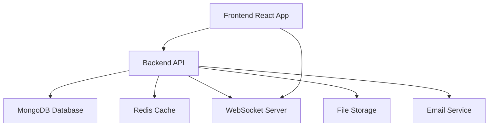

# 🚀 NevoStack HRMS - Complete Setup Guide

## 📋 Overview

This is a comprehensive HR Management System with advanced features including:
- **Frontend**: React + TypeScript + ShadCN UI + Tailwind CSS
- **Backend**: Node.js + Express + MongoDB + Redis
- **Authentication**: JWT with device tracking
- **Real-time**: WebSocket support
- **Security**: Advanced security features
- **Deployment**: Docker-ready

---

## 🛠️ Prerequisites

### Required Software
- **Node.js** (v18 or higher) - [Download](https://nodejs.org/)
- **MongoDB** (v5 or higher) - [Download](https://www.mongodb.com/try/download/community)
- **Redis** (Optional, for caching) - [Download](https://redis.io/download)
- **Docker** (Optional, for containerized deployment) - [Download](https://docker.com/)

### Optional Services
- **Cloudinary Account** (for logo uploads) - [Sign up](https://cloudinary.com/)

### System Requirements
- **RAM**: 4GB minimum, 8GB recommended
- **Storage**: 2GB free space
- **OS**: Windows 10+, macOS 10.15+, Ubuntu 18.04+

---

## 🚀 Quick Start

### 1. Clone the Repository
```bash
git clone <repository-url>
cd NevostackTool
```

### 2. Backend Setup

#### Option A: Manual Setup
```bash
# Navigate to backend
cd backend

# Install dependencies
npm install

# Setup environment (Windows)
copy .env.example .env

# Setup environment (Linux/Mac)
cp .env.example .env

# Edit .env file with your configuration
# Minimum required:
# MONGODB_URI=mongodb://localhost:27017/nevostack_hrms
# JWT_ACCESS_SECRET=your_secret_here
# JWT_REFRESH_SECRET=your_refresh_secret_here

# Start MongoDB (if not using Docker)
# Windows: Start MongoDB service
# Linux/Mac: mongod --dbpath /path/to/db

# Start the backend server
npm run dev
```

#### Option B: Docker Setup
```bash
cd backend

# Start all services with Docker
docker-compose up -d

# Check service status
docker-compose ps
```

### 3. Frontend Setup
```bash
# Navigate to frontend
cd tiny-typer-tool-09

# Install dependencies
npm install

# Start the development server
npm run dev
```

---

## 🔧 Configuration

### Backend Environment Variables (.env)
```env
# Server Configuration
PORT=5000
NODE_ENV=development
CORS_ORIGIN=http://localhost:5173

# Database
MONGODB_URI=mongodb://localhost:27017/nevostack_hrms

# JWT Secrets
JWT_ACCESS_SECRET=your_super_secret_access_key_here
JWT_REFRESH_SECRET=your_super_secret_refresh_key_here
JWT_ACCESS_EXPIRY=15m
JWT_REFRESH_EXPIRY=7d

# Security
BCRYPT_ROUNDS=12
RATE_LIMIT_WINDOW_MS=900000
RATE_LIMIT_MAX_REQUESTS=100

# Optional: Redis for caching
REDIS_URL=redis://localhost:6379

# Optional: Cloudinary for image uploads (Required for logo uploads)
CLOUDINARY_CLOUD_NAME=your_cloudinary_cloud_name
CLOUDINARY_API_KEY=your_cloudinary_api_key
CLOUDINARY_API_SECRET=your_cloudinary_api_secret

# Optional: Email configuration
SMTP_HOST=smtp.gmail.com
SMTP_PORT=587
SMTP_USER=your_email@gmail.com
SMTP_PASS=your_app_password
```

### Frontend Environment Variables (.env.local)
```env
# API Configuration
VITE_API_BASE_URL=http://localhost:5000/api
VITE_WS_URL=ws://localhost:5001

# Feature Flags
VITE_ENABLE_NOTIFICATIONS=true
VITE_ENABLE_WEBSOCKETS=true
```

### Cloudinary Setup (for Logo Uploads)

1. **Create a Cloudinary Account**
   - Visit [cloudinary.com](https://cloudinary.com/) and sign up for a free account
   - Verify your email and log into the dashboard

2. **Get API Credentials**
   - Go to your Cloudinary Dashboard
   - Navigate to "Settings" → "Upload" tab
   - Copy your Cloud Name, API Key, and API Secret

3. **Configure Environment Variables**
   - Add the following to your backend `.env` file:
   ```env
   CLOUDINARY_CLOUD_NAME=your_cloud_name_here
   CLOUDINARY_API_KEY=your_api_key_here
   CLOUDINARY_API_SECRET=your_api_secret_here
   ```

4. **Test the Setup**
   - Start your backend server
   - Try uploading a logo during company registration
   - Check Cloudinary dashboard to confirm uploads

**Note**: Logo uploads are optional. If Cloudinary is not configured, users can still register companies without logos.

---

## 🔐 Default Login Credentials

### Demo Accounts (Development)
| Role | Email | Password | Description |
|------|-------|----------|-------------|
| Super Admin | admin@demo.com | password123 | Full system access |
| HOD | hod@demo.com | hod123 | Department head access |
| Manager | manager@demo.com | mgr123 | Team management |
| HR | hr@demo.com | hr123 | HR operations |
| HR Manager | hrmanager@demo.com | hrm123 | HR management |
| Member | member@demo.com | mem123 | Basic employee access |

### Legacy Credentials
| Username | Password | Role |
|----------|----------|------|
| admin | admin | Super Admin |

---

## 🌐 Application URLs

- **Frontend**: http://localhost:5173
- **Backend API**: http://localhost:5000/api
- **API Health Check**: http://localhost:5000/health
- **WebSocket**: ws://localhost:5001 (if enabled)

---

## 📁 Project Structure

```
NevostackTool/
├── backend/                    # Backend API
│   ├── models/                # Database models
│   ├── routes/                # API routes
│   ├── middleware/            # Express middleware
│   ├── scripts/               # Utility scripts
│   ├── server.js              # Main server file
│   ├── package.json           # Backend dependencies
│   ├── Dockerfile             # Docker configuration
│   └── docker-compose.yml     # Multi-service setup
├── tiny-typer-tool-09/        # Frontend Application
│   ├── src/
│   │   ├── components/        # React components
│   │   ├── services/          # API services
│   │   ├── hooks/             # Custom hooks
│   │   ├── types/             # TypeScript types
│   │   └── config/            # Configuration files
│   ├── public/                # Static assets
│   └── package.json           # Frontend dependencies
└── SETUP_GUIDE.md            # This file
```

---

## 🔧 Development Workflow

### Starting Development
```bash
# Terminal 1: Start MongoDB (if not using Docker)
mongod

# Terminal 2: Start Backend
cd backend
npm run dev

# Terminal 3: Start Frontend
cd tiny-typer-tool-09
npm run dev
```

### With Docker
```bash
# Start all services
cd backend
docker-compose up -d

# Start frontend separately
cd ../tiny-typer-tool-09
npm run dev
```

---

## 🎯 Key Features

### ✅ Completed Features
- **Authentication System**: JWT with device tracking
- **User Management**: CRUD operations with role-based access
- **Company Registration**: Complete signup with logo upload support
- **Task Management**: Advanced task tracking and assignment
- **Attendance System**: Check-in/out with location tracking
- **Leave Management**: Request and approval workflow
- **Meeting Scheduler**: Meeting organization and management
- **Event Management**: Company events with notifications
- **Real-time Notifications**: WebSocket-based live updates
- **Device Security**: Multi-device management and security
- **Role-Based Access**: Hierarchical permission system
- **Analytics Dashboard**: Role-specific analytics and reports
- **File Management**: Secure file uploads and storage (Cloudinary integration)
- **API Integration**: Complete REST API with proper error handling
- **Docker Support**: Production-ready containerization

### 🚧 Optional Enhancements
- **Email Notifications**: SMTP integration
- **Advanced Analytics**: Detailed reporting
- **Testing Suite**: Comprehensive test coverage
- **Performance Optimization**: Caching and optimization

---

## 🐛 Troubleshooting

### Common Issues

#### MongoDB Connection Error
```bash
# Check if MongoDB is running
mongod --version

# Start MongoDB service (Windows)
net start MongoDB

# Start MongoDB service (Linux)
sudo systemctl start mongod
```

#### Port Already in Use
```bash
# Find process using port 5000
netstat -ano | findstr :5000     # Windows
lsof -i :5000                    # Linux/Mac

# Kill the process
taskkill /PID <PID> /F           # Windows
kill -9 <PID>                    # Linux/Mac
```

#### NPM Installation Issues
```bash
# Clear npm cache
npm cache clean --force

# Delete node_modules and reinstall
rm -rf node_modules package-lock.json
npm install
```

#### CORS Issues
- Ensure `CORS_ORIGIN` in backend `.env` matches frontend URL
- Default frontend runs on `http://localhost:5173`

### Getting Help
1. Check console logs for detailed error messages
2. Verify all environment variables are set correctly
3. Ensure all required services are running
4. Check network connectivity between frontend and backend

---

## 🚀 Production Deployment

### Docker Production Deployment
```bash
# Build and start production containers
cd backend
docker-compose -f docker-compose.yml up -d

# Check logs
docker-compose logs -f
```

### Manual Production Deployment
```bash
# Backend
cd backend
npm install --production
NODE_ENV=production npm start

# Frontend
cd tiny-typer-tool-09
npm run build
# Serve dist/ folder with nginx or similar
```

---

## 📊 System Architecture



---

## 🎯 User Roles & Permissions

### Role Hierarchy
```
Super Admin
├── Admin
├── HR Manager
└── HOD (Head of Department)
    └── Manager
        └── Member
```

### Permission Matrix
| Feature | Super Admin | Admin | HR Manager | HOD | Manager | Member |
|---------|-------------|-------|------------|-----|---------|--------|
| User Management | ✅ | ✅ | ✅ | ✅ | ✅ | ❌ |
| Department Management | ✅ | ✅ | ✅ | ✅ | ❌ | ❌ |
| Task Assignment | ✅ | ✅ | ✅ | ✅ | ✅ | ❌ |
| Attendance Tracking | ✅ | ✅ | ✅ | ✅ | ✅ | ✅ |
| Leave Management | ✅ | ✅ | ✅ | ✅ | ✅ | ✅ |
| Analytics | ✅ | ✅ | ✅ | ✅ | ✅ | ❌ |

---

## 📞 Support

If you encounter any issues:

1. **Check the logs**: Both frontend and backend console logs
2. **Verify configuration**: Ensure all environment variables are set
3. **Test connectivity**: Verify MongoDB and Redis connections
4. **Review documentation**: This guide covers most common scenarios

---

## 🎉 Success!

If everything is working correctly, you should see:
- ✅ Frontend running on http://localhost:5173
- ✅ Backend API responding at http://localhost:5000/health
- ✅ Successful login with demo credentials
- ✅ Dashboard displaying without errors

**Your NevoStack HRMS system is now ready for use!** 🚀

---

*Happy coding! Your advanced HR Management System is now fully operational.*
