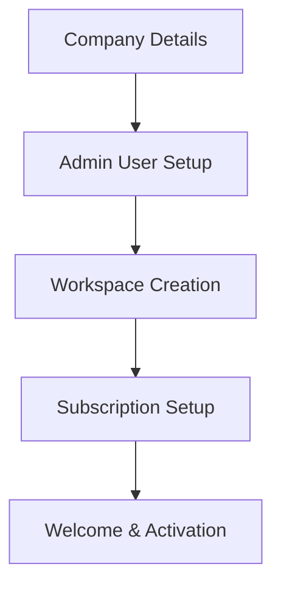
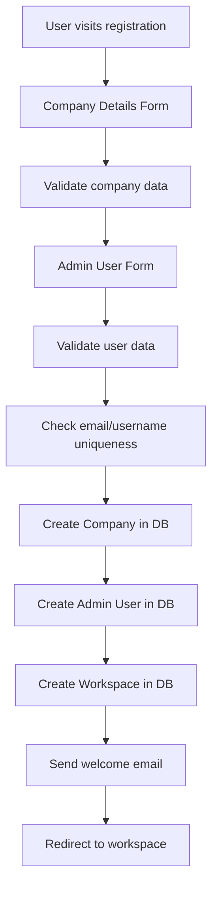
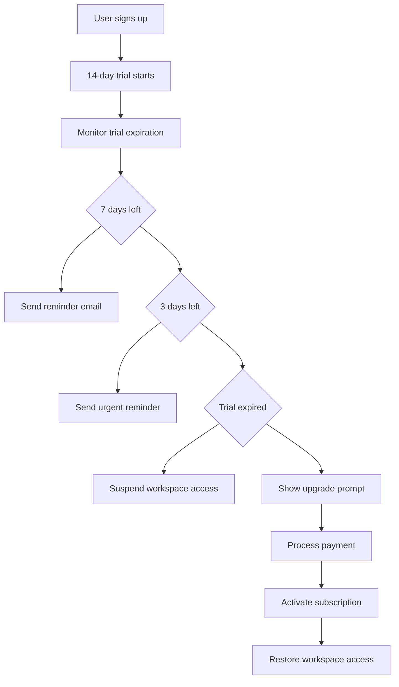

# 🚀 **Nevostack SaaS Platform - Complete Understanding Guide**

## 📋 **What is Nevostack?**

Nevostack is a modern, scalable **Software-as-a-Service (SaaS) platform** designed for organizations to manage their digital workspace efficiently. It provides a complete solution for companies to create, manage, and access their dedicated workspaces with role-based access control, subscription management, and comprehensive organizational tools.

---

## 🏗️ **Architecture Overview**

### **Multi-Tenant SaaS Architecture**
- **Single Application, Multiple Organizations**: One codebase serves multiple companies
- **Isolated Workspaces**: Each company has its own dedicated workspace
- **Shared Infrastructure**: Cost-effective resource utilization
- **Scalable Design**: Handles growth from startups to enterprises

### **Technology Stack**
- **Backend**: Node.js, Express.js, MongoDB Atlas
- **Frontend**: React, TypeScript, Vite, Shadcn UI
- **Authentication**: JWT tokens with role-based access
- **Database**: MongoDB with Mongoose ODM
- **Deployment**: Ready for cloud deployment (AWS, Vercel, etc.)

---

## 👥 **User Roles & Permissions**

### **1. Super Admin**
- **Access**: Full platform access
- **Capabilities**:
  - Manage all companies and workspaces
  - View platform analytics
  - Configure system settings
  - Manage subscriptions and billing
  - Access to all user data

### **2. Company Admin**
- **Access**: Company-specific workspace
- **Capabilities**:
  - Manage company settings
  - Add/remove team members
  - Configure workspace preferences
  - Manage company billing
  - View company analytics

### **3. Regular Users**
- **Access**: Limited to assigned workspace
- **Capabilities**:
  - Access company resources
  - Collaborate with team members
  - Use assigned features
  - Manage personal profile

---

## 🌟 **Key Features & Functionalities**

### **1. Company Registration & Onboarding**

#### **Multi-Step Registration Process**


#### **Registration Flow**:
1. **Step 1**: Company Information
   - Company name, email, phone
   - Industry, employee count, address
   - Website and description

2. **Step 2**: Admin User Creation
   - Admin name, email, username
   - Password with strength validation
   - Role assignment (automatically set as admin)

3. **Step 3**: Workspace Setup
   - Automatic subdomain generation (`company.nevostack.com`)
   - Default workspace creation
   - Trial period activation (14 days)

4. **Step 4**: Subscription Selection
   - Starter, Professional, Enterprise plans
   - Feature comparison
   - Billing cycle selection

### **2. Workspace Management**

#### **Subdomain Access**
- **Custom URLs**: `company.nevostack.com`
- **SSL Enabled**: Secure HTTPS connections
- **DNS Management**: Automatic subdomain routing

#### **Workspace Features**:
- **Dashboard**: Overview of company metrics
- **Team Management**: Add/manage team members
- **Settings**: Customize workspace appearance
- **Billing**: Subscription management
- **Analytics**: Usage statistics and reports

### **3. Authentication & Security**

#### **JWT-Based Authentication**
```javascript
// Token Structure
{
  "userId": "user_id",
  "companyId": "company_id",
  "role": "admin|user",
  "exp": 1640995200
}
```

#### **Security Features**:
- **Password Hashing**: bcrypt with salt rounds
- **Token Expiration**: Automatic logout after inactivity
- **Role-Based Access**: Different permissions per role
- **CORS Protection**: Configured for allowed origins
- **Input Validation**: Server-side validation with express-validator
- **Rate Limiting**: Prevents brute force attacks

### **4. Subscription Management**

#### **Available Plans**:

| Plan | Price | Users | Features |
|------|-------|-------|----------|
| **Starter** | $29/month | 10 users | Basic features, email support |
| **Professional** | $79/month | 50 users | Advanced features, phone support |
| **Enterprise** | $199/month | Unlimited | All features, dedicated support |

#### **Trial Period**:
- **14-day free trial** for new workspaces
- **Full feature access** during trial
- **Automatic conversion** to paid plan
- **Trial expiration notifications**

### **5. Database Structure**

#### **Core Models**:

##### **Company Model**
```javascript
{
  name: String,           // Company name
  email: String,          // Contact email
  phone: String,          // Contact phone
  domain: String,         // company.nevostack.com
  industry: String,       // Industry type
  employeeCount: Number,  // Number of employees
  status: String,         // active, inactive, suspended
  subscription: {
    plan: String,         // starter, professional, enterprise
    status: String,       // active, trial, expired
    startDate: Date,
    features: [String]
  },
  settings: {
    theme: String,
    timezone: String,
    language: String,
    notifications: Object
  },
  createdAt: Date,
  updatedAt: Date
}
```

##### **User Model**
```javascript
{
  username: String,       // Unique username
  email: String,          // Email address
  password: String,       // Hashed password
  firstName: String,      // First name
  lastName: String,       // Last name
  role: String,           // super_admin, admin, user
  companyId: ObjectId,    // Reference to company
  status: String,         // active, inactive
  security: {
    lastPasswordChange: Date,
    twoFactorEnabled: Boolean,
    emailVerified: Boolean,
    phoneVerified: Boolean
  },
  createdAt: Date,
  updatedAt: Date
}
```

##### **Workspace Model**
```javascript
{
  name: String,           // Workspace display name
  subdomain: String,      // URL subdomain
  domain: String,         // Full domain URL
  companyId: ObjectId,    // Owning company
  ownerId: ObjectId,      // Admin user
  plan: String,           // Subscription plan
  status: String,         // active, trial, suspended
  trialEndsAt: Date,      // Trial expiration
  billing: {
    interval: String,     // monthly, yearly
    amount: Number,
    currency: String,
    nextBillingDate: Date
  },
  limits: {
    maxUsers: Number,
    maxStorage: Number,
    apiCalls: Number
  },
  usage: {
    currentUsers: Number,
    storageUsed: Number,
    apiCallsUsed: Number
  },
  customization: {
    primaryColor: String,
    theme: String
  },
  settings: {
    notifications: Object,
    timezone: String,
    dateFormat: String
  },
  createdAt: Date,
  updatedAt: Date
}
```

---

## 🔌 **API Endpoints**

### **Authentication Endpoints**
```
POST /api/auth/register          - User registration
POST /api/auth/login             - User login
POST /api/auth/logout            - User logout
POST /api/auth/refresh           - Refresh access token
GET  /api/auth/profile           - Get user profile
PUT  /api/auth/change-password   - Change password
POST /api/auth/register-company  - Complete company registration
```

### **Workspace Endpoints**
```
GET  /api/workspaces/subdomain/:subdomain  - Get workspace by subdomain
GET  /api/workspaces                     - List all workspaces (admin)
POST /api/workspaces                     - Create new workspace
PUT  /api/workspaces/:id                 - Update workspace
DELETE /api/workspaces/:id               - Delete workspace
GET  /api/workspaces/:id/current         - Get current workspace
GET  /api/workspaces/:id/stats           - Get workspace statistics
GET  /api/workspaces/:id/billing         - Get billing information
PUT  /api/workspaces/:id/upgrade         - Upgrade subscription
```

### **Company Management**
```
GET  /api/companies                      - List companies (super admin)
POST /api/companies                      - Create company
GET  /api/companies/:id                  - Get company details
PUT  /api/companies/:id                  - Update company
DELETE /api/companies/:id                - Delete company
GET  /api/companies/:id/stats            - Company statistics
GET  /api/companies/:id/users            - Company users
```

### **User Management**
```
GET  /api/users                          - List users
POST /api/users                          - Create user
GET  /api/users/:id                      - Get user details
PUT  /api/users/:id                      - Update user
DELETE /api/users/:id                    - Delete user
PUT  /api/users/:id/role                 - Change user role
PUT  /api/users/:id/status               - Change user status
```

---

## 🎨 **Frontend Features**

### **React Components Structure**
```
src/
├── components/
│   ├── SaaS/
│   │   ├── SaaSLoginPage.tsx           # Main login/access page
│   │   ├── SaaSCompanyRegistration.tsx # Multi-step registration
│   │   ├── TenantProvider.tsx          # Multi-tenant context
│   │   ├── WorkspaceManagement.tsx     # Workspace settings
│   │   └── SaaSCompaniesManagement.tsx # Company admin panel
│   └── Auth/
│       ├── AuthProvider.tsx            # Authentication context
│       └── LoginForm.tsx               # Login form
├── services/
│   ├── apiService.ts                   # HTTP client with retry logic
│   ├── authService.ts                  # Authentication service
│   └── workspaceService.ts             # Workspace operations
└── types/
    ├── saas.ts                         # SaaS type definitions
    └── index.ts                        # Global types
```

### **Key Frontend Features**:

#### **1. Multi-Step Registration**
- **Step 1**: Company details with validation
- **Step 2**: Admin user creation
- **Step 3**: Subscription plan selection
- **Step 4**: Workspace activation

#### **2. Subdomain Access**
- Custom subdomain input: `company.nevostack.com`
- Real-time subdomain validation
- Automatic workspace detection

#### **3. Responsive Design**
- Mobile-first approach
- Shadcn UI components
- Dark/light theme support
- Accessible design patterns

#### **4. Real-time Validation**
- Email format validation
- Password strength checking
- Subdomain availability checking
- Form field validation

---

## 📊 **Business Logic & Workflows**

### **Company Registration Flow**


### **Workspace Access Flow**
```mermaid
graph TD
    A[User enters subdomain] --> B[Validate subdomain format]
    B --> C[Query workspace by subdomain]
    C --> D{Workspace exists?}
    D -->|No| E[Show "not found" error]
    D -->|Yes| F{Check status}
    F -->|Active/Trial| G[Create tenant context]
    F -->|Suspended| H[Show suspended message]
    G --> I[Load workspace dashboard]
```

### **Subscription Management**


---

## 🔒 **Security Implementation**

### **Authentication Security**
- **JWT Tokens**: Stateless authentication with expiration
- **Password Security**: bcrypt hashing with salt rounds
- **Session Management**: Automatic token refresh
- **Logout**: Secure token invalidation

### **API Security**
- **CORS Protection**: Configured allowed origins
- **Rate Limiting**: Prevents abuse and DoS attacks
- **Input Validation**: Server-side validation for all inputs
- **SQL Injection Protection**: MongoDB/Mongoose built-in protection

### **Access Control**
- **Role-Based Access**: Different permissions per user type
- **Resource Ownership**: Users can only access their company's data
- **API Authorization**: Token validation on protected routes

---

## 📈 **Scalability & Performance**

### **Database Optimization**
- **Indexing**: Optimized queries with proper indexing
- **Pagination**: Efficient data loading for large datasets
- **Connection Pooling**: MongoDB connection optimization
- **Caching Strategy**: Redis integration ready

### **API Performance**
- **Response Compression**: Gzip compression enabled
- **Request Caching**: Browser caching with proper headers
- **Database Query Optimization**: Efficient MongoDB queries
- **Error Handling**: Graceful error responses

### **Frontend Optimization**
- **Code Splitting**: Lazy loading of components
- **Bundle Optimization**: Vite build optimization
- **Image Optimization**: Efficient asset loading
- **Progressive Loading**: Fast initial page loads

---

## 🚀 **Deployment & DevOps**

### **Environment Configuration**
```bash
# Production Environment Variables
NODE_ENV=production
PORT=5000
MONGODB_URI=mongodb+srv://...
JWT_SECRET=your-super-secret-key
CORS_ORIGIN=https://yourdomain.com
RATE_LIMIT_MAX_REQUESTS=100
RATE_LIMIT_WINDOW_MS=900000
```

### **Deployment Options**
- **Vercel**: Frontend deployment with serverless functions
- **Heroku**: Full-stack deployment
- **AWS**: Scalable cloud infrastructure
- **Docker**: Containerized deployment

### **Monitoring & Logging**
- **Error Tracking**: Centralized error logging
- **Performance Monitoring**: Response time tracking
- **User Analytics**: Usage statistics and behavior tracking
- **Security Monitoring**: Failed login attempts and suspicious activity

---

## 🎯 **Use Cases & Applications**

### **1. Small Business Management**
- Team collaboration tools
- Project management
- Customer relationship management
- Inventory management

### **2. Startup Platforms**
- Internal tools and dashboards
- User management systems
- Billing and subscription management
- Analytics and reporting

### **3. Enterprise Solutions**
- Multi-department organization
- Role-based access control
- Compliance management
- Audit trails and reporting

### **4. SaaS Product Base**
- White-label solutions
- Multi-tenant applications
- Customizable workspaces
- Subscription-based features

---

## 🛠️ **Development & Maintenance**

### **Code Quality**
- **TypeScript**: Type-safe development
- **ESLint**: Code quality and consistency
- **Prettier**: Code formatting
- **Husky**: Git hooks for quality checks

### **Testing Strategy**
- **Unit Tests**: Component and function testing
- **Integration Tests**: API endpoint testing
- **E2E Tests**: Full user workflow testing
- **Load Testing**: Performance under high traffic

### **Documentation**
- **API Documentation**: Swagger/OpenAPI specs
- **Component Documentation**: Storybook for UI components
- **User Guides**: Comprehensive user documentation
- **Developer Guides**: Setup and deployment guides

---

## 💡 **Future Enhancements**

### **Planned Features**
- **Mobile App**: React Native mobile application
- **API Marketplace**: Third-party integrations
- **Advanced Analytics**: Detailed usage insights
- **Workflow Automation**: Custom business process automation
- **File Management**: Document storage and collaboration
- **Real-time Collaboration**: Live editing and commenting
- **AI Integration**: Smart suggestions and automation

### **Scalability Improvements**
- **Microservices Architecture**: Service separation for better scaling
- **Global CDN**: Worldwide content delivery
- **Database Sharding**: Horizontal scaling for large datasets
- **Caching Layer**: Redis for performance optimization

---

## 🎉 **Conclusion**

Nevostack is a **production-ready SaaS platform** that provides:

✅ **Complete Multi-Tenant Architecture**  
✅ **Secure Authentication & Authorization**  
✅ **Flexible Subscription Management**  
✅ **Scalable Database Design**  
✅ **Modern React Frontend**  
✅ **Comprehensive API Layer**  
✅ **Role-Based Access Control**  
✅ **Real-time Features Ready**  
✅ **Deployment Ready**  
✅ **Extensively Customizable**  

The platform is designed to **grow with your business** - from startup to enterprise scale. It provides a solid foundation for building any SaaS application with proper multi-tenancy, security, and scalability considerations.

**Ready to deploy and scale! 🚀**


